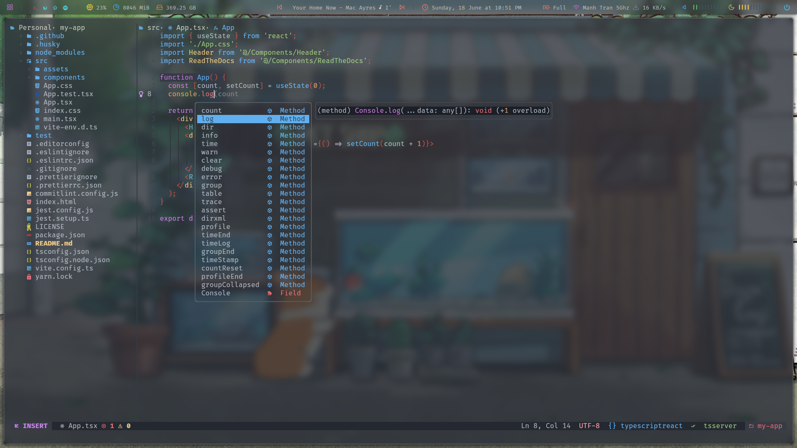
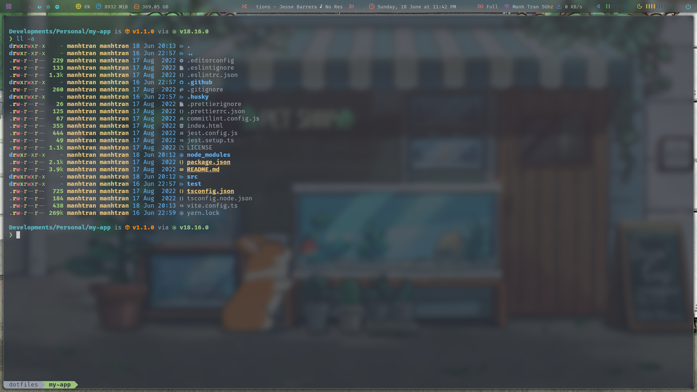

# ManhTran's dotfiles

This is my opinionated linux dotfiles. Feel free to use, this is how it looks
like

It has been a long time since I update my config. I has moved to hyprland instead of i3. I also use chezmoi to manage my dotfiles now. So please ignore everything I wrote below, I'll update the README sometime later.




## Contents

- [Hyprland config](#hypr-config)
- [Fish config](#fish-config)
- [Neovim config](#neovim-config)

### Dependencies

I use Arch btw, and I like yay

```
yay -S \
        fish htop-vim neovim kitty alacritty \
        flameshot fzf exa \
        firefox-developer-edition thunderbird \
        spotify discord lutris steam
```

### hypr config

- [dunst](https://wiki.archlinux.org/title/Dunst) - Notifications
- [flameshot](https://flameshot.org) - Screen capture
- [kitty](https://sw.kovidgoyal.net/kitty) - Terminal Emulator
- [picom](https://wiki.archlinux.org/title/Picom) - Compositor
- [polybar](https://github.com/polybar/polybar) - Status bar
- [rofi](https://github.com/davatorium/rofi) - Application Launcher

### Fish config

- [Fish shell](https://fishshell.com/) - Default shell
- [Fisher](https://github.com/jorgebucaran/fisher) - Plugin manager
- [Oh-my-fish](https://github.com/oh-my-fish/oh-my-fish) - Framework manager
- [Starship](https://starship.rs/) - Prompt
- [Fnm](https://github.com/Schniz/fnm) - Node version manager
- [Nerd fonts](https://github.com/ryanoasis/nerd-fonts) - Powerline-patched
  fonts. I use Fira Code.
- [Exa](https://the.exa.website/) - `ls` replacement
- [ghq](https://github.com/x-motemen/ghq) - Local Git repository organizer
- [peco](https://github.com/peco/peco) - Interactive filtering

### Neovim config

- [Nvchad](https://nvchad.com/) - Config template
- [williamboman/mason.nvim](https://github.com/williamboman/mason.nvim) -
  Portable package manager that runs everywhere Neovim runs. Easily install and
  manage LSP servers, DAP servers, linters, and formatters.
- [max397574/better-escape.nvim](https://github.com/max397574/better-escape.nvim) -
  jj, jk to escape
- [f-person/git-blame.nvim](https://github.com/f-person/git-blame.nvim) - Show
  git blame info.
- [ggandor/leap.nvim](https://github.com/ggandor/leap.nvim) - A refined
  successor of Lightspeed, aiming to establish a widely accepted standard
  interface extension for moving around in Vim-like editors.
- [gelguy/wilder.nvim](https://github.com/gelguy/wilder.nvim) - A plugin for
  fuzzy command line autocompletion.
- [kevinhwang91/nvim-hlslens](https://github.com/kevinhwang91/nvim-hlslens) -
  Better glance at matched information, seamlessly jump between matched
  instances.
- [windwp/nvim-ts-autotag](https://github.com/windwp/nvim-ts-autotag) -
  Autoclose and autorename html tag
- [nvim-pack/nvim-spectre](https://github.com/nvim-pack/nvim-spectre) - Search
  and replace
- [rmagatti/auto-session](https://github.com/rmagatti/auto-session) - Auto
  restore session
- [glepnir/lspsaga.nvim](https://github.com/glepnir/lspsaga.nvim) - A
  light-weight LSP plugin based on Neovim's built-in LSP with a highly
  performant UI.
- [koenverburg/peepsight.nvim](https://github.com/koenverburg/peepsight.nvim) -
  Focus only the function your cursor is in.
- [sindrets/diffview.nvim](https://github.com/sindrets/diffview.nvim) - Single
  tabpage interface for easily cycling through diffs for all modified files for
  any git rev.
- [booperlv/nvim-gomove](https://github.com/booperlv/nvim-gomove) - A complete
  plugin for moving and duplicating blocks and lines, with complete fold
  handling, reindenting,
- [codota/tabnine-nvim](https://github.com/codota/tabnine-nvim) - AI Tabnine for
  Neovim

### References:

This config was heavily inspired by

- [devaslife](https://github.com/craftzdog/dotfiles-public) - Takuya Matsuyama
- [adi1090x](https://github.com/adi1090x) - Aditya Shakya
- [jdhao](https://github.com/jdhao) - Jdhao
